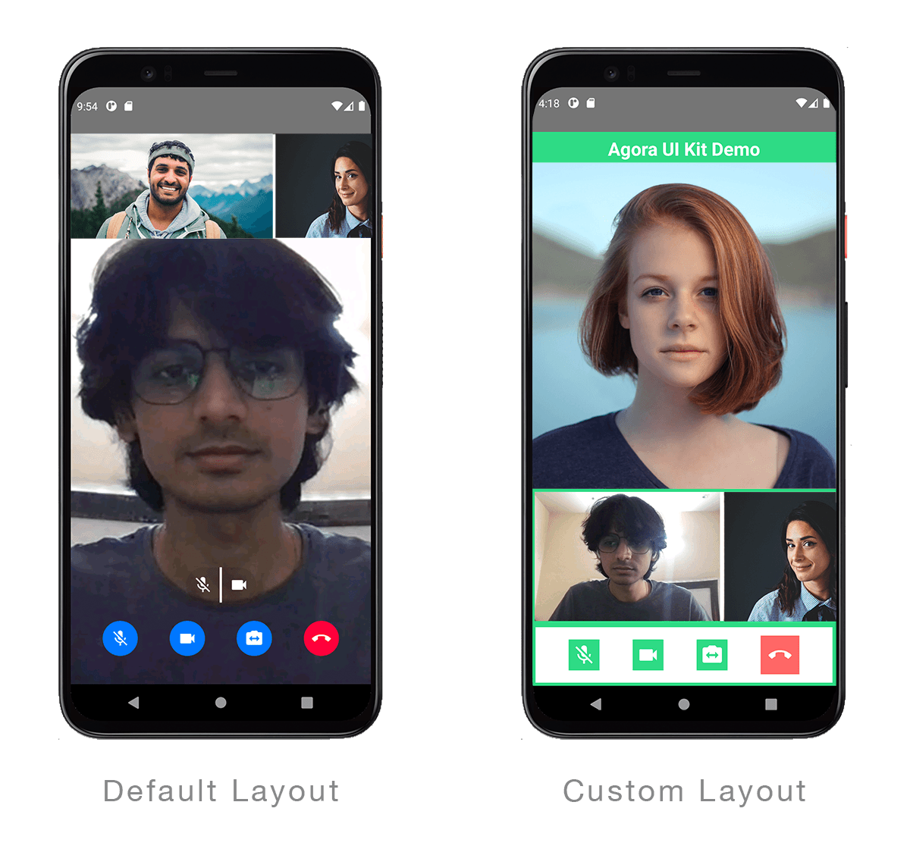

# Examples
## Basic Example 
```jsx
import React, {useState} from 'react';
import AgoraUIKit, {PropsInterface} from 'agora-rn-uikit';

const App = () => {
  const [videoCall, setVideoCall] = useState(true);
  const props: PropsInterface = {
    rtcProps: {
      appId: '<Agora App ID>',
      channel: 'test',
    },
    callbacks: {
      EndCall: () => setVideoCall(false),
    },
  };

  return videoCall ? (
    <AgoraUIKit rtcProps={props.rtcProps} callbacks={props.callbacks} />
  ) : null;
};
export default App;
```
## Customisation

### Adding custom styling
The way to assign any of the properties is the same across iOS and macOS.
This is an example of a few properties being assigned, and then applied to Agora

```jsx
const App = () => {
  ...
  const props: PropsInterface = {
    styleProps: {
      localBtnContainer: {
        backgroundColor: '#fff',
        bottom: 0,
        paddingVertical: 10,
        borderWidth: 4,
        borderColor: '#2edb85',
        height: 80,
      },
      ...
    },
    ...
  };

  return (
    <AgoraUIKit
      styleProps={props.styleProps}
      ...
    />
  )
};

export default App;
```

### Full Example
Passing in styleprops to customise the look of the app.



```jsx
import React, {useState} from 'react';
import AgoraUIKit, {VideoRenderMode, PropsInterface} from 'agora-rn-uikit';
import {SafeAreaView, Text, TouchableOpacity} from 'react-native';

const App = () => {
  const [videoCall, setVideoCall] = useState(true);
  const props: PropsInterface = {
    rtcProps: {
      appId: '<Agora App ID>',
      channel: 'test',
    },
    styleProps: {
      iconSize: 30,
      theme: '#ffffffee',
      videoMode: {
        max: VideoRenderMode.Hidden,
        min: VideoRenderMode.Hidden,
      },
      overlayContainer: {
        backgroundColor: '#2edb8533',
        opacity: 1,
      },
      localBtnStyles: {
        muteLocalVideo: btnStyle,
        muteLocalAudio: btnStyle,
        switchCamera: btnStyle,
        endCall: {
          borderRadius: 0,
          width: 50,
          height: 50,
          backgroundColor: '#f66',
          borderWidth: 0,
        },
      },
      localBtnContainer: {
        backgroundColor: '#fff',
        bottom: 0,
        paddingVertical: 10,
        borderWidth: 4,
        borderColor: '#2edb85',
        height: 80,
      },
      maxViewRemoteBtnContainer: {
        top: 0,
        alignSelf: 'flex-end',
      },
      remoteBtnStyles: {
        muteRemoteAudio: remoteBtnStyle,
        muteRemoteVideo: remoteBtnStyle,
        remoteSwap: remoteBtnStyle,
        minCloseBtnStyles: remoteBtnStyle,
      },
      minViewContainer: {
        bottom: 80,
        top: undefined,
        backgroundColor: '#fff',
        borderColor: '#2edb85',
        borderWidth: 4,
        height: '26%',
      },
      minViewStyles: {
        height: '100%',
      },
      maxViewStyles: {
        height: '64%',
      },
      UIKitContainer: {height: '94%'},
    },
    callbacks: {
      EndCall: () => setVideoCall(false),
    },
  };

  return (
    <SafeAreaView>
      <Text style={textStyle}>Agora UI Kit Demo</Text>
      {videoCall ? (
        <>
          <AgoraUIKit
            styleProps={props.styleProps}
            rtcProps={props.rtcProps}
            callbacks={props.callbacks}
          />
        </>
      ) : (
        <TouchableOpacity
          style={startButton}
          onPress={() => setVideoCall(true)}>
          <Text style={{...textStyle, width: '50%'}}>Start Call</Text>
        </TouchableOpacity>
      )}
    </SafeAreaView>
  );
};

const textStyle = {
  color: '#fff',
  backgroundColor: '#2edb85',
  fontWeight: '700',
  fontSize: 24,
  width: '100%',
  borderColor: '#2edb85',
  borderWidth: 4,
  textAlign: 'center',
  textAlignVertical: 'center',
};

const btnStyle = {
  borderRadius: 2,
  width: 40,
  height: 40,
  backgroundColor: '#2edb85',
  borderWidth: 0,
};

const startButton = {
  justifyContent: 'center',
  alignItems: 'center',
  alignContent: 'center',
  height: '90%',
};

const remoteBtnStyle = {backgroundColor: '#2edb8555'};

export default App;
```

## Recomposing the App
You can select individual components of the UI Kit and use them to build your own layout/functionality.

```jsx
import React, {useState} from 'react';
import {ScrollView, View} from 'react-native';
import {PropsInterface} from 'agora-rn-uikit';
import {
  MaxVideoView,
  MinVideoView,
  RtcConfigure,
} from 'agora-rn-uikit/Components';
import {MaxUidConsumer} from 'agora-rn-uikit/src/MaxUidContext';
import {MinUidConsumer} from 'agora-rn-uikit/src/MinUidContext';
import styles from 'agora-rn-uikit/src/Style';

const App = () => {
  const [videoCall, setVideoCall] = useState(true);
  const props: PropsInterface = {
    rtcProps: {
      appId: '<Agora App ID>',
      channel: 'test',
    },
    callbacks: {
      EndCall: () => setVideoCall(false),
    },
  };

  return videoCall ? (
    <View style={props.styleProps?.UIKitContainer}>
      <RtcConfigure>
        <MaxUidConsumer>
          {maxUsers =>
            maxUsers[0] ? (
              <MaxVideoView user={maxUsers[0]} key={maxUsers[0].uid} />
            ) : null
          }
        </MaxUidConsumer>
        <ScrollView
          showsHorizontalScrollIndicator={false}
          horizontal={true}
          style={{
            ...styles.minContainer,
            width: '100%',
          }}>
          <MinUidConsumer>
            {minUsers =>
              minUsers.map(user => (
                <MinVideoView user={user} key={user.uid} showOverlay={true} />
              ))
            }
          </MinUidConsumer>
        </ScrollView>
      </RtcConfigure>
    </View>
  ) : null;
};
export default App;
```